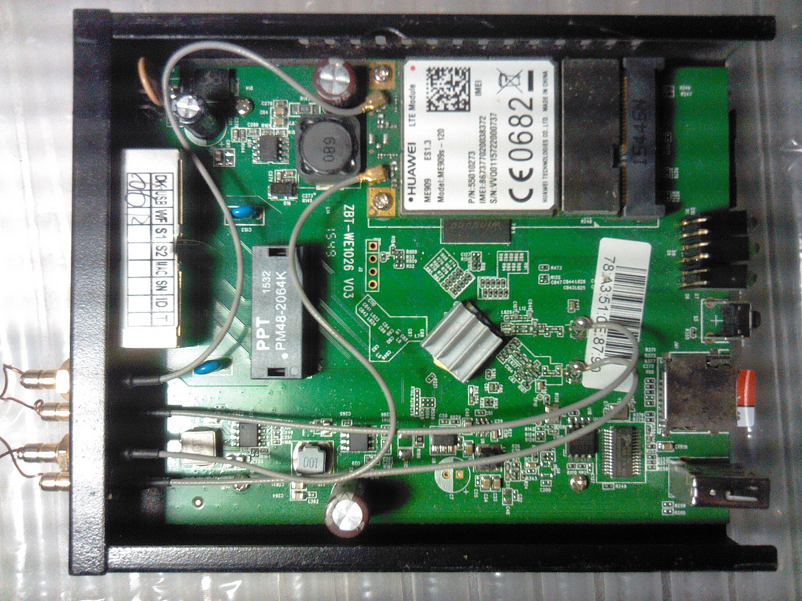

# MT7620A based router OpenWRT firmware [](https://creativecommons.org/licenses/by-sa/4.0/)
**openwrt 19.07.2**
## Brand names
ZBT WE1026, ZBT WE826 and many others no-names from Aliexpress, [see below](#how-to-buy)  
   
## Hardware
128-256MB memory  
16MB FLASH  
HUAWEI ME909 LTE modem  
## Description
The goal of this firmware - a general-purpose server with communication capabilities for boat and camper with zero administration and graphical user interface.  
### Firmware include:  
* standard OpenWRT user interface witn necessary plugins 
* all OpenWRT communication features: ssh, vpn, routing, firevall, etc.
* ads blocking via DNS requests
* auto mounting usb and flash storage
* Midnight Commander
* NGINX web server
* PHP7
* full usb support
* support GNSS receivers, AIS, etc via [gpsd](https://gpsd.io/) (need configuration first)
### Firmware not include:
* ability to install new software
### Works
All
### Not works
Some LED's
## Firmware installation
Use standard OpenWRT GUI tools, or  

1. Connect to router via ssh
2. Clear `/tmp` to free at least 16MB
3. Mount usb FLASH with firmware:  
```
mkdir /mnt/extUSB
mount /dev/sda1 /mnt/extUSB
```
4. Burn:
```
sysupgrade -v /mnt/extUSB/*.bin
```
this will copy firmware to `/tmp` and install it with save the settings
## Usage
Place your web applications and data to SD-card and configure web server.  
For example,  [GaladrielMap](http://galadrielmap.hs-yachten.at/) navigation suite may be installed as described in the project's [/emergencykit/nginx_galadrielmap_conf/README.txt](https://github.com/VladimirKalachikhin/Galadriel-map/tree/master/emergencykit)  
Plug in GNSS reciever to usb port.
## How to buy
China's are our friends!  
See AliExpress to buy:  
[aliexpress.com/item/32842622527.html](https://www.aliexpress.com/item/32842622527.html)  
[aliexpress.com/item/32802136305.html](https://www.aliexpress.com/item/32802136305.html)  
[aliexpress.com/item/33003636964.html](https://www.aliexpress.com/item/33003636964.html)  
[aliexpress.com/item/32956443588.html](https://www.aliexpress.com/item/32956443588.html)  
[aliexpress.com/item/33011561091.html](https://www.aliexpress.com/item/33011561091.html)  
[aliexpress.com/item/32795180047.html](https://www.aliexpress.com/item/32795180047.html)  
[aliexpress.com/item/32954175411.html](https://www.aliexpress.com/item/32954175411.html)  
and many other sellers  
When purchasing ask 16MB FLASH, HUAWEI ME909 LTE modem and OpenWRT (not SDK) firmware. 256NB RAM preferably.
## Build firmware
You may want to build firmware yourself for 32MB FLASH version hardware or other modem. See [how-to](https://openwrt.org/docs/guide-developer/build-system/start) for it. The `diffconfig` included.